<!-- ╔═══════════════════════════════════════════════════╗ -->
<!-- ║  Auto-generated by GitHub Actions                  ║ -->
<!-- ║  Theme : evening       Updated : 19 Sep 2026  05:24 PM IST  ║ -->
<!-- ╚═══════════════════════════════════════════════════╝ -->

<div align="center">



</div>


---

<div align="center">

</div>

---

<div align="center">

</div>

---

## 🧑‍💻 About Me

```yaml
───────────────────────────────────────────
  name       : Rohit Vishwakarma
  github     : @RKPROGRAMMING10K
  location   : Nashik
  bio        : "I am a passionate Flutter Developer focused on building scalable, real-world mob"
  stats:
    repositories : 98
    total_stars  : 8
    followers    : 3
    following    : 0
    total_forks  : 0
  current_theme  : evening   🌇
  last_updated   : 19 Sep 2026  05:24 PM IST
───────────────────────────────────────────
```

---

## 🛠️ Tech Stack

<div align="center">

          

</div>

---

## 📊 Language Distribution

<div align="center">

</div>

---

## 🔥 Top Repositories

| Repository | Description | Stars | Forks | Language |
|------------|-------------|-------|-------|----------|
| [**rkprogramming10k**](https://github.com/RKPROGRAMMING10K/rkprogramming10k) |  | ⭐ 2 | 🔀 0 | `Python` |
| [**Github-Profile-Tracker**](https://github.com/RKPROGRAMMING10K/Github-Profile-Tracker) | This repo keep track of you profile in best ways | ⭐ 2 | 🔀 0 | `TypeScript` |
| [**Livestream-Overlay-Backend**](https://github.com/RKPROGRAMMING10K/Livestream-Overlay-Backend) |  | ⭐ 1 | 🔀 0 | `Python` |
| [**Livestream-Overlay-Frontend**](https://github.com/RKPROGRAMMING10K/Livestream-Overlay-Frontend) |  | ⭐ 1 | 🔀 0 | `JavaScript` |
| [**RV-DevBot**](https://github.com/RKPROGRAMMING10K/RV-DevBot) |  | ⭐ 1 | 🔀 0 | `None` |
| [**rkprogramming.io**](https://github.com/RKPROGRAMMING10K/rkprogramming.io) |  | ⭐ 1 | 🔀 0 | `JavaScript` |

---

## 📈 GitHub Activity

<div align="center">

[](https://github.com/RKPROGRAMMING10K)

</div>

<div align="center">

[](https://github.com/RKPROGRAMMING10K)&nbsp;&nbsp;[](https://github.com/RKPROGRAMMING10K)

</div>

---

## 🌐 Connect with Me

<div align="center">

[](https://github.com/RKPROGRAMMING10K)

[](https://github.com/RKPROGRAMMING10K)

</div>

---


<div align="center">

<sub>
🤖 This README is <b>fully automated</b> — rebuilt every day at <b>7:00 PM IST</b> via GitHub Actions.<br>
⏱ <b>Last updated:</b> 19 Sep 2026  05:24 PM IST &nbsp;|&nbsp; 🎨 <b>Active theme:</b> Evening 🌇<br>
🌅 <i>Theme changes automatically: Morning · Afternoon · Evening · Night</i>
</sub>

</div>
